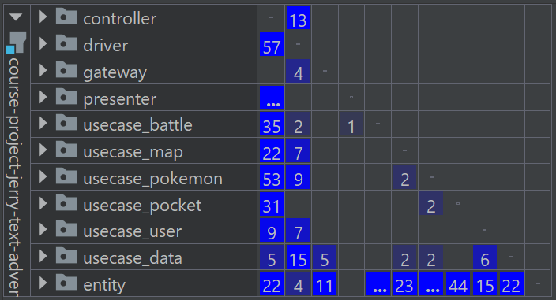
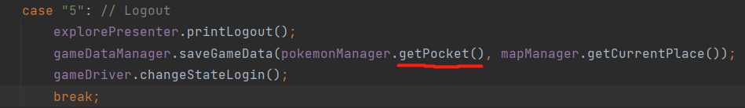
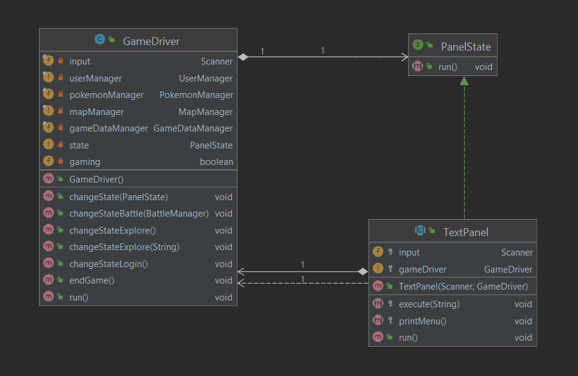
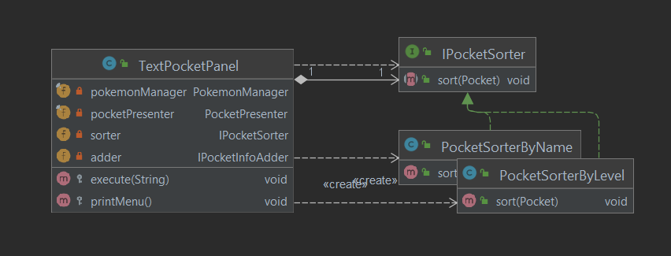
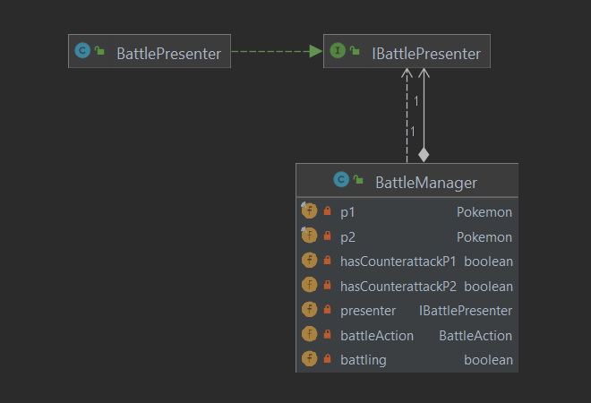

# Design Document

In this project, we made a text adventure game called Pokemon World with features including login, exploring, battle,
browsing pokemons, saving and load game data (see [Specification](specification.md)). We followed the clean architecture
and SOLID principles, which is explained in this document.

We were implementing two sets of UI - a text UI and a GUI. The text UI is a more complete product, and the GUI is a
trial and may still have many problems. One of the problems of the GUI is that the code breaks clean architecture and
SOLID principles at many places, which still requires a lot of refactoring. If we still have more time, refactoring and
merging the GUI would be our next goal, but unfortunately, we do not have time. We will not delete the GUI, but we put
it in the package named `addition_part`, you may check it out if you think it is interesting. But the main submission of
the project would be the non-GUI part, which this document will be mainly addressing.

## SOLID

### SRP (Single Responsibility Principle)

- The `User` class is only responsible for storing a user's login information. It is separated from any gaming
  information. So, `User` is only changed if the login system logic is changed. Any changes in the gameplay will not
  affect `User`.
- The `UserManager` is only responsible for handling `User` objects. So, the only source of change is a change in login
  system logic.
- The presenter classes are only responsible for displaying messages. They contain no business logic. So, they are only
  changed if we want to change the displayed message. Any change to business logic will not affect the presenter
  classes.
- The `BattleManager` and `BattleAction` implementing classes are only responsible for executing actions in a battle.
  They are changed only if the major rules for a battle are changed. A change in value-related rules will not affect
  them since value calculations are separated into calculator classes. However, the random algorithm for opponent's
  action is put inside the `BattleManager`, creating an extra source of change. This can be improved by extracting such
  algorithm into a separated class.
- The gateway classes are only responsible for reading and writing files. They contain no business logic. A specific
  gateway class is only responsible for one kind of data.

### OCP (Open Closed Principle)

- The state design pattern implemented in the controller classes allows us to extend features easily - just create
  another panel class implementing `PanelState`. It requires no modifications of codes that already exist.
- The strategy design pattern implemented in `usecase_pocket`, which gives the user options for how the list of pokemons
  will be displayed, allows us to add displaying options easily. Say we also want to allow sort by attack point, then we
  can simply add a new `PocketSorterByAttackPoint` class implementing `IPocketSorter`. The existing codes need not be
  changed.

### LSP (Liskov Substitution Principle)

- `TextPanel` is the parent class of all concrete text panels. Their behaviors are the same - printing a menu and take
  in the choice from the user, and execute that choice. Each subclass only extends `TextPanel`, but not modifies or
  deletes what `TextPanel` does.
- `BasePokemonData` is the parent class of `PokemonData`. Any `BasePokemonData` object can be replaced with
  a `PokemonData` object since `BasePokemonData` and `PokemonData` behave exactly the same on methods
  that `BasePokemonData` has.
- `Presenter` is the parent class of all concrete presenters. Each presenter subclass only extends `Presenter` to print
  various messages, but the behavior of `Presenter`, such as queueing messages and print all messages with or without
  enumeration, are exactly the same in the subclasses.

### ISP (Interface Segregation Principle)

- The interface of `PanelState` is simply one method - `run`, this is as small as possible, no implementation
  of `PanelState` are forced to implement unnecessary methods, as they all need to run.
- Similarly, `IPocketSorter`, `IPocketInfoAdder`, `IJsonReader`, `IReadWriter`, `BattleAction` are all kept minimal,
  they only specify methods that are necessary to be implemented.
- `IBattlePresenter` does have quite a lot of methods, but this is used for dependency injection, which is a different
  case. But even it has many methods, those methods are all needed for presenting a battle.

### DIP (Dependency Inversion Principle)

- Our design follows the clean architecture, which means that the outer layer depends on the inner layer, but not the
  reverse. The outer layers are more concrete as they enforce more business rules, while the inner layers are more
  abstract. Hence, following clean architecture means that concrete things depends on abstract thins, but abstract
  things does not depend on concrete things.
- We used dependency injection to follow the dependency inversion principle.
- `PokemonManager` has a `IJsonReader` as parameter in the constructor, which is an interface for json readers.
  Hence, `PokemonManager` depends not on the gateway class, but the interface.
- Similarly, `BattleManager` depends on the interface `IBattlePresenter`, `GameDataManager` depends on the
  interface `IReadWriter`, and `MapManager` depends on the interface `IJsonReader`.
- As usecase classes interacts with gateway and presenter classes via interfaces, the dependency is inverted.

## Clean Architecture

This is a [UML diagram](UML.png) for the whole project. We first observe a general trend - the inner-layer (of clean
architecture) classes are towards the top, and the outer-layer classes are towards the bottom. So, in general, we see
that our project is indeed following the clean architecture. Now, we will inspect the details.

- The inner layers do not depend on outer layers. This is demonstrated by this dependency matrix
  
  Note that the last column is blank, this means that classes in entity package does not depend on other packages.
- The dependency is only from outer layer to adjacent inner layer, so controller/gateway/presenter classes are not
  depend on entity classes, but they depend on usecase classes to manipulate entity classes. As you may check, there are
  no imports or method calls of entity classes in the controller/gateway/presenter classes.
- Remark: the dependency matrix says that we do have non-adjacent dependencies, which is illustrated with the first
  three entries of the entity row being non-empty. Let us look at an example:
  
  At line 92 in `TextExplorePanel` (controller), a `Pocket` (entity) object is got by the `pokemonManager` and then is
  passed in as argument to the `saveGameData` method. But `TextExplorePanel` does not import `Pocket`, nor call any
  methods in `Pocket`. So, we believe this should be fine.
- We use dependency injection to invert the dependency. Sometimes it is easier to call presenter/gateway's methods in
  the usecase since the usecase has the information needed to pass into the method. However, the usecase should not
  depend on them directly, but it can depend on interfaces.

## Design Pattern

### State

In phase 1, we had this problem about panel switching. In a program execution, a sequence of panels, say p1,
..., pn should be constructed and each executes `run` method. When pi is running, it should take
in client's choice and decide what pi+1 should be. However, if we construct and run pi+1 in p
i directly, then the execution of `run` in pi would only end when the whole program execution ends,
which is not ideal.

Hence, we created an interface `PanelState` with method `run`, which is implemented by all panels. We also created a
class `GameDriver` storing a field `state` of type `PanelState` with public methods `changeState` for updating it.
In `GameDriver`, there is a loop that simply calls `state.run()`. Now, panel switching becomes much easier. We simply
pass the `GameDriver` object itself into the panels, and let the panels call `changeState` to update `state`.

By implementing state design pattern, we made the program much easier to extend since we can add new panels by creating
new panel classes, and make panels to call `changeState` to change to the new panel whenever needed. This requires only
extension, but no modification, of the exiting code. Here is a UML diagram of the state design pattern. There are more
implementations classes of `PanelState` other than `TextPanel` - this is just an example.

### Strategy

We have the feature that allows the user to choose the display style, such as the sorting, of a list of pokemons at
runtime. We created an interface `IPocketSorter` with method `sort`, with some implementing classes. In the controller
`TextPocketPanel`, we have a field `sorter` of type `IPocketSorter`. When the user choose a specific sorting strategy,
the controller will assign `sorter` with corresponding implementing class, and simply calls `sorter.sort()`.

By implementing strategy design pattern, the program is more extendable and flexible. Adding a new sorting algorithm is
easy - just create a new class implementing `IPocketSorter`, and the controller can construct the new class and assign
it to `sorter` as needed. In addition, `IPocketInfoAdder` and `BattleAction` are also examples of strategy.

### Dependency Injection

We use dependency injection to invert the dependency so that clean architecture and dependency inversion principle are
followed. The implementation of this design pattern includes `IReadWriter`, `IJsonReader`, `IBattlePresenter`. We shall
use `IBattlePresenter` as an example.

To present a battle, the presenting class needs to know the information about the battle. However, the presenter or
controller class have no knowledge of that, but the battle usecases do have such knowledge. Hence, it is much easier to
call presenter's methods directly in the usecase. But this would break clean architecture. So, we let the usecase call
methods from the interface `BattlePresenter`, and let controller pass in a concrete implementation of such interface
into the usecase. In this way, the usecase only depends on the interface, but not the presenter class.

### Iterator

This allows us to iterate through a `Pocket` object.

### Simple factory

We created a simple factory to produce a `Pokemon` from a `BasePokemon`. This helps reduce the complexity
of `PokemonManager`, and it follows the single responsibility principle.

### Memento

This is implemented in the GUI to allow saving and loading.

## Use of GitHub Features

To work on a task, we always open up a new branch with our name and task to implement. We commit and push to the branch
as we go, and create pull request when the task is done. We will notice our teammates to review the pull request, and if
there are no disagreement, we merge the branch to the main branch. We also used GitHub issue so that teammates can know
what we are working on, so that we can avoid different people working on the same thing. When a merge causes a problem,
we use the revert feature to return to an older version.

## Code Style and Documentation

Most Intellij warnings are fixed. There are several remains, but we think they may not make sense. For instance,
Intellij is suggesting replacing the switch statement to an enhanced one, but the program does not compile after
replacing, which is probably due to the different versions of java.

In `PocketSorterByLevel` and `PocketSorterByName`, we decided to make the nested class static, as Intellij gave us
warnings to do so. Making them static would cause coupling, however, they are private nested class, which are only used
in the class that they nested in and are supposed to be highly coupled with them. So, we believe this should be fine.

We added javadoc for all public methods.

## Testing

During testing, we faced several problems. Some classes with private field have no constructor nor setters for the
field. They may be only constructed from a gateway class by reading from files. So, the test case cannot create objects
of such classes if not appeal to the gateway class. But another problem arises, which is that we do no want test cases
to modify our database, but it may need to or otherwise some methods are not testable. So, we created a new directory to
store database only for testing, and refactored the gateway so that file paths are no longer hardcoded, but are stored
in a configuration file. So, in order for the tests to pass, you would need to change `game_data` to `test_data` in the
path strings in `configuration.json`.

## Refactoring

The major refactoring we have done is separating controller and presenter, and implementing state design pattern to the
controller. See [Pull Request](https://github.com/CSC207-UofT/course-project-jerry-text-adventure/pull/15).

The reason for doing the refactoring is that in phase 1, the controller and presenter were highly coupled. In fact, they
were the same class. This is a code smell that resist future extensions. For instance, it is very hard to add a new UI -
we have to change the controller altogether.

The reason for implementing state is that in phase 1, the information passing when switching panels were done in a quite
complex way, so that it become harder and harder as we add more panels. We were looking for a simpler way to do panel
switches. Thanks to our TA, we are suggested to use state design pattern. Now, adding panels is much easier.

We also did a refactoring to eliminate hardcoding in the gateway classes. The gateway classes used to store a path
string directly. Now, we created a configuration file to store those path strings, and gateway classes would get paths
from the configuration tile. This allows us to modify the paths easily.
See [Pull Request](https://github.com/CSC207-UofT/course-project-jerry-text-adventure/pull/42).

There are still refactoring to be done. For example, in the method `opponentAction` of `BattleManager`, the probability
of what the opponent choose to do is hardcoded. Also, formulas to calculators are also hardcoded. These can be put into
separate files as well.

## Code Organization

We classify and package our class by architecture. Since we are following clean architecture, this is a very natural way
to organize the code. It reminds us not to break the clean architecture during coding. It is also easier for us to check
whether clean architecture are broken somewhere.

## Functionality

The main functionalities of the game, which includes login, explore, battle, browse pokemons, saving and loading, are
all implemented.